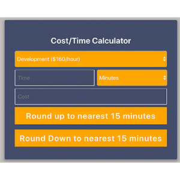

    

<h1 align="center"> Cost Time Calculator </h1>
## Running the application
### 1. Clone it
`git clone https://github.com/dboston528/cost-time-calculator.git`

### starting the virtual environemnt
`. venv/bin/activate`

starting the front end
`npm start` in the frontend directory

