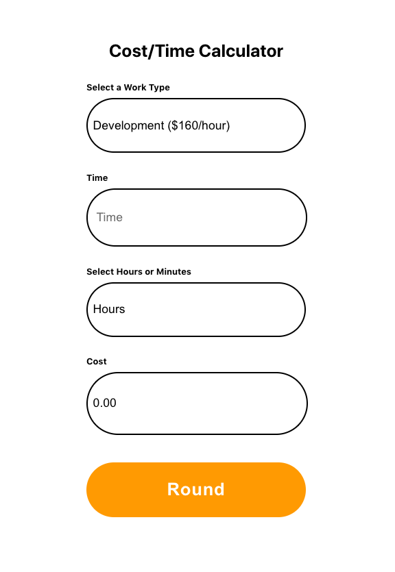

    
    <h1 align="center"> Cost Time Calculator </h1>

## Running the application:

1. Clone it
`git clone https://github.com/dboston528/cost-time-calculator.git`

2. Change to backend folder 
`cd backend-flask`

3. Install the virtual environment (Mac)
`python3 -m venv venv`

4. Start the virtual environemnt
`. venv/bin/activate`

5. Install Flask
`pip install Flask`

6. Install the following dependencies
flask cors
`pip install -U flask-cors`
Flask RESTful
`pip install flask-restful`

7. Start the backend
`FLASK_APP=rates.py flask run`

8. Open a new terminal and change to root project folder (This may differ depending on where you downloaded the file)
`cd cost-time-calculator`

9. Change to the frontend directory
`cd frontend-react`

10. Install dependencies
`npm install`

11. Start the frontend
`npm start`

12. Go to http://localhost:3000/
and you should see the app!!
(If you have another server running on the default port, the terminal may prompt you to start the app on another port.)
